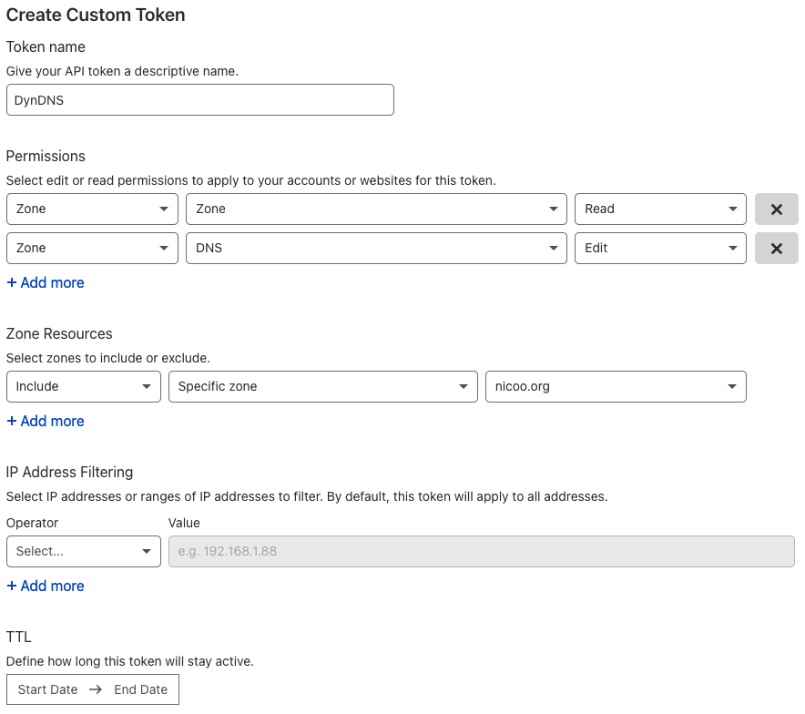

# cloudflare-dyndns

Middleware for updating [Cloudflare](https://www.cloudflare.com/) DNS records through an [AVM FRITZ!Box](https://en.avm.de/products/fritzbox/).

## Getting started

### Create a Cloudflare API token

Create a [Cloudflare API token](https://dash.cloudflare.com/profile/api-tokens) with **read permissions** for the scope `Zone.Zone` and **edit permissions** for the scope `Zone.DNS`.



### :rocket: Option 1: Self-host cloudflare-dyndns

#### Run on Docker

Start cloudflare-dyndns:

```bash
docker run -p 80:80 ghcr.io/l480/cloudflare-dyndns:latest
```

#### Run on Kubernetes

Use the [Helm Chart](./helm-chart) to deploy cloudflare-dyndns to Kubernetes or directly [pull it from the repositories OCI registry](https://helm.sh/docs/topics/registries/#enabling-oci-support):

```bash
helm pull oci://ghcr.io/l480/charts/cloudflare-dyndns --version 0.1.0
```

### :cloud: Option 2: Use my free cloud service

If you don't want to host cloudflare-dyndns yourself, feel free to use my cloud service. Just use this Update URL in your FRITZ!Box:

```
https://functions.nicoo.org/function/cloudflare-dyndns?token=<pass>&record=www&zone=example.com&ipv4=<ipaddr>&ipv6=<ip6addr>
```

### Configure your FRITZ!Box

| FRITZ!Box Setting | Value                                                                                                   | Description                                                                                                                          |
| ----------------- | ------------------------------------------------------------------------------------------------------- | ------------------------------------------------------------------------------------------------------------------------------------ |
| Update URL        | `https://functions.nicoo.org/function/cloudflare-dyndns?token=<pass>&record=www&zone=example.com&ipv4=<ipaddr>&ipv6=<ip6addr>` | Replace the URL parameter `record` and `zone` with your domain name. If required you can omit either the `ipv4` or `ipv6` URL parameter. |
| Domain Name       | www.example.com                                                                                         | The FQDN from the URL parameter `record` and `zone`.                                                                                 |
| Username          | admin                                                                                                   | You can choose whatever value you want.                                                                                              |
| Password          | ●●●●●●                                                                                                  | The API token you’ve created earlier.                                                                                                |
