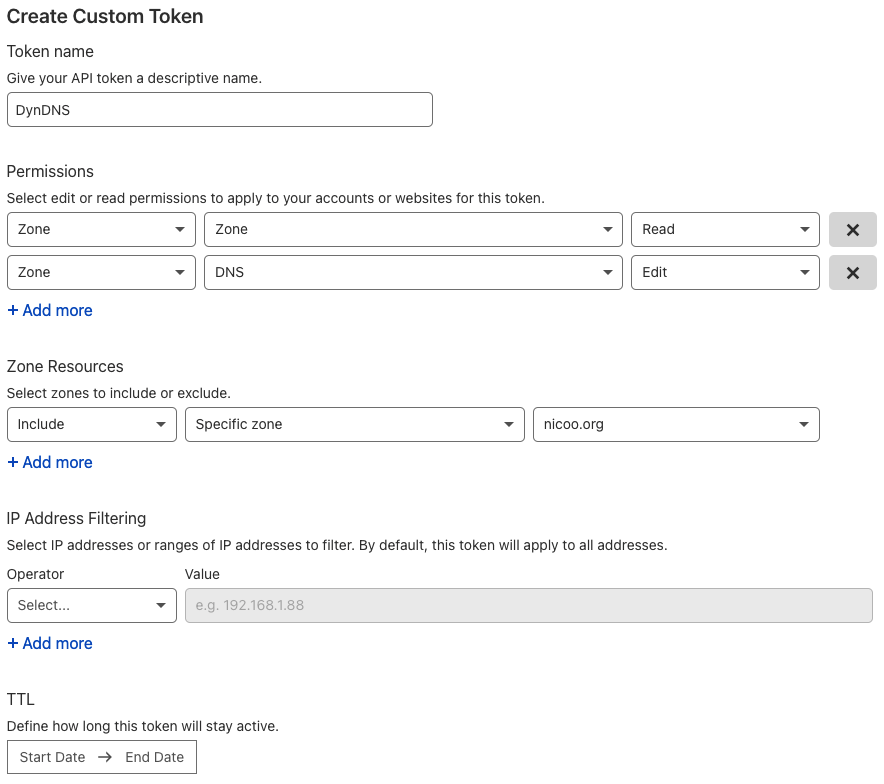

# cloudflare-dyndns

[](https://github.com/l480/cloudflare-dyndns/actions/workflows/ci.yml)
[](https://github.com/l480/cloudflare-dyndns/pkgs/container/cloudflare-dyndns)
[](https://github.com/l480/cloudflare-dyndns/pkgs/container/charts%2Fcloudflare-dyndns)
[](./LICENSE)

Middleware for updating [Cloudflare](https://www.cloudflare.com/) DNS records
through an [AVM FRITZ!Box](https://en.avm.de/products/fritzbox/) (or any
DynDNS-capable client: `ddclient`, `inadyn`, or a plain `curl`/cron job).

The FRITZ!Box calls an "Update URL" whenever its WAN IP changes; this
service translates that call into Cloudflare API writes.

## Getting started

### Create a Cloudflare API token

Create a [Cloudflare API token](https://dash.cloudflare.com/profile/api-tokens)
with **read permissions** for `Zone.Zone` and **edit permissions** for
`Zone.DNS`, scoped to the specific zone(s) you intend to update.



### :rocket: Option 1: Self-host cloudflare-dyndns

#### Run on Docker

```bash
docker run -d -p 8080:8080 \
  --read-only --cap-drop=ALL --security-opt no-new-privileges \
  --user 10001:10001 \
  ghcr.io/l480/cloudflare-dyndns:latest
```

Or with Docker Compose — see [`compose.yaml`](./compose.yaml).

#### Run on Kubernetes

Use the [Helm chart](./helm-chart) or pull it directly from the repository's
OCI registry:

```bash
helm pull oci://ghcr.io/l480/charts/cloudflare-dyndns --version <chart-version>
```

See [`docs/deployment.md`](./docs/deployment.md) for full instructions.

### :cloud: Option 2: Use my free cloud service

If you don't want to self-host, use this Update URL in your FRITZ!Box:

```
https://dyndns.nicoo.org/?token=<pass>&record=www&zone=example.com&ipv4=<ipaddr>&ipv6=<ip6addr>
```

### Configure your FRITZ!Box

| FRITZ!Box Setting | Value | Description |
| ----------------- | ----- | ----------- |
| Update URL        | `https://dyndns.nicoo.org/?token=<pass>&record=www&zone=example.com&ipv4=<ipaddr>&ipv6=<ip6addr>` | Replace `record` and `zone` with your domain name. Omit `ipv4` or `ipv6` if not needed. |
| Domain Name       | `www.example.com` | The FQDN from `record` + `zone`. |
| Username          | `admin` | Any value you want. |
| Password          | ●●●●●● | The API token you created earlier. |

More clients (`ddclient`, `inadyn`, `curl`) and troubleshooting:
[`docs/clients.md`](./docs/clients.md).

## Security notes

- **The API token travels in the URL query string** — this is a property
  of the DynDNS Update URL protocol, not a bug. Always use HTTPS, and scope
  your token narrowly (`Zone.DNS:Edit` + `Zone.Zone:Read` on specific
  zones only — never your Global API Key).
- Prefer self-hosting for sensitive zones; the hosted instance is a
  convenience, not a trust boundary you don't control.
- Full details: [`SECURITY.md`](./SECURITY.md).

## Documentation

- [`docs/api.md`](./docs/api.md) — the full HTTP API contract
- [`docs/configuration.md`](./docs/configuration.md) — every `CFDD_*` setting
- [`docs/clients.md`](./docs/clients.md) — FRITZ!Box, ddclient, inadyn, curl
- [`docs/deployment.md`](./docs/deployment.md) — Docker, Compose, Kubernetes
- [`CONTRIBUTING.md`](./CONTRIBUTING.md) — development setup, the
  compatibility contract, commit conventions
